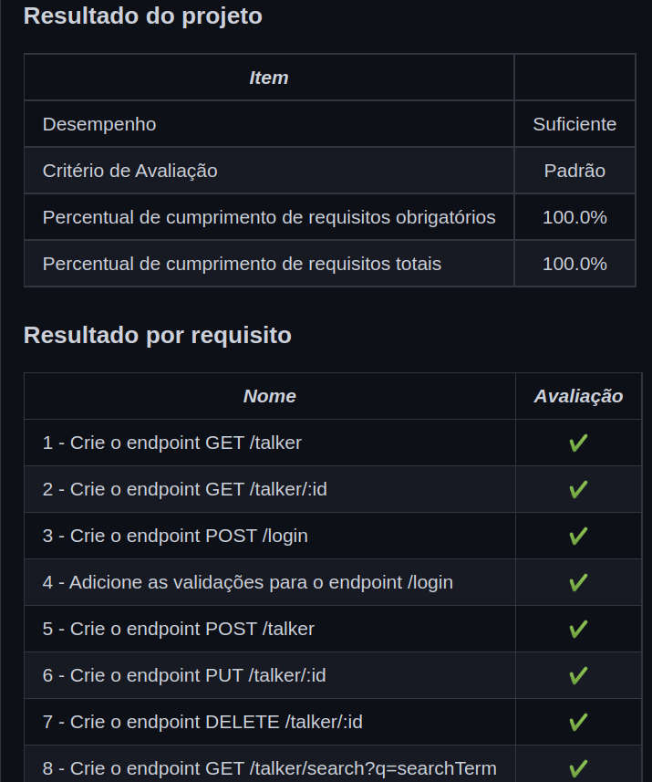

<h1> Projeto Talker Manager </h1>
<h2>Sobre </h2>

 O desafio foi construir uma aplicação de cadastro de talkers (palestrantes) em que seria possível cadastrar, visualizar, pesquisar, editar e excluir informações. 

Para isso desenvolvi uma API de um CRUD (Create, Read, Update e Delete) de palestrantes (talkers), como também, alguns endpoints que irão ler e escrever em um arquivo utilizando o módulo fs. 

<h2> Usabilidade </h2>

<ul> 
<li>
   Clonar o repositório
</li>
<li>
  Dentro da pasta do repositório -> npm install
</li>
<li>
  docker-compose up
</li>
</ul>

<h2>Nota</h2>

